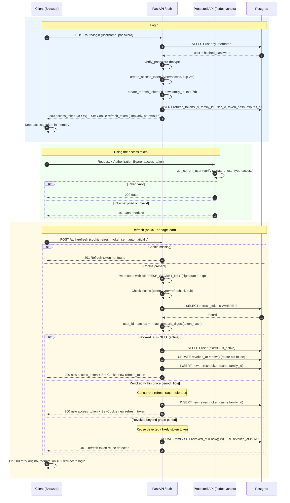

```mermaid
sequenceDiagram
    autonumber
    participant C as Client (Browser)
    participant A as FastAPI /auth
    participant API as Protected API (/todos, /chats)
    participant DB as Postgres

    rect rgb(235, 245, 255)
    Note over C,DB: Login
    C->>A: POST /auth/login (username, password)
    A->>DB: SELECT user by username
    DB-->>A: user + hashed_password
    A->>A: verify_password (bcrypt)
    A->>A: create_access_token (type=access, exp 2m)
    A->>A: create_refresh_token (jti, new family_id, exp 7d)
    A->>DB: INSERT refresh_tokens (jti, family_id, user_id, token_hash, expires_at)
    A-->>C: 200 access_token (JSON) + Set-Cookie refresh_token (HttpOnly, path=/auth)
    C->>C: Keep access_token in memory
    end

    rect rgb(240, 255, 240)
    Note over C,API: Using the access token
    C->>API: Request + Authorization Bearer access_token
    API->>API: get_current_user (verify signature, exp, type=access)
    alt Token valid
        API-->>C: 200 data
    else Token expired or invalid
        API-->>C: 401 Unauthorized
    end
    end

    rect rgb(255, 250, 230)
    Note over C,DB: Refresh (on 401 or page load)
    C->>A: POST /auth/refresh (cookie refresh_token sent automatically)
    alt Cookie missing
        A-->>C: 401 Refresh token not found
    else Cookie present
        A->>A: jwt.decode with REFRESH_SECRET_KEY (signature + exp)
        A->>A: Check claims (token_type=refresh, jti, sub)
        A->>DB: SELECT refresh_tokens WHERE jti
        DB-->>A: record
        A->>A: user_id matches + hmac.compare_digest(token_hash)
        alt revoked_at is NULL (active)
            A->>DB: SELECT user (exists + is_active)
            A->>DB: UPDATE revoked_at = now() (rotate old token)
            A->>DB: INSERT new refresh token (same family_id)
            A-->>C: 200 new access_token + Set-Cookie new refresh_token
        else Revoked within grace period (10s)
            Note over A: Concurrent refresh race - tolerated
            A->>DB: INSERT new refresh token (same family_id)
            A-->>C: 200 new access_token + Set-Cookie new refresh_token
        else Revoked beyond grace period
            Note over A: Reuse detected - likely stolen token
            A->>DB: UPDATE family SET revoked_at = now() WHERE revoked_at IS NULL
            A-->>C: 401 Refresh token reuse detected
        end
    end
    C->>C: On 200 retry original request, on 401 redirect to login
    end
```