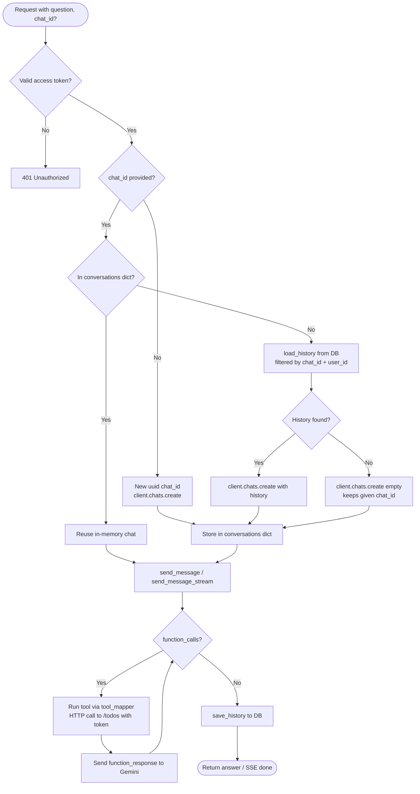

```mermaid
flowchart TD
    Start([Request with question, chat_id?]) --> Auth{Valid access token?}
    Auth -- No --> E401[401 Unauthorized]
    Auth -- Yes --> HasId{chat_id provided?}
    HasId -- No --> New[New uuid chat_id<br/>client.chats.create]
    HasId -- Yes --> Mem{In conversations dict?}
    Mem -- Yes --> Use[Reuse in-memory chat]
    Mem -- No --> Load[load_history from DB<br/>filtered by chat_id + user_id]
    Load --> Found{History found?}
    Found -- Yes --> Restore[client.chats.create with history]
    Found -- No --> Fresh[client.chats.create empty<br/>keeps given chat_id]
    New --> Cache[Store in conversations dict]
    Restore --> Cache
    Fresh --> Cache
    Use --> Send
    Cache --> Send[send_message / send_message_stream]
    Send --> FC{function_calls?}
    FC -- Yes --> Tool[Run tool via tool_mapper<br/>HTTP call to /todos with token]
    Tool --> Reply[Send function_response to Gemini]
    Reply --> FC
    FC -- No --> Save[save_history to DB]
    Save --> Out([Return answer / SSE done])
```