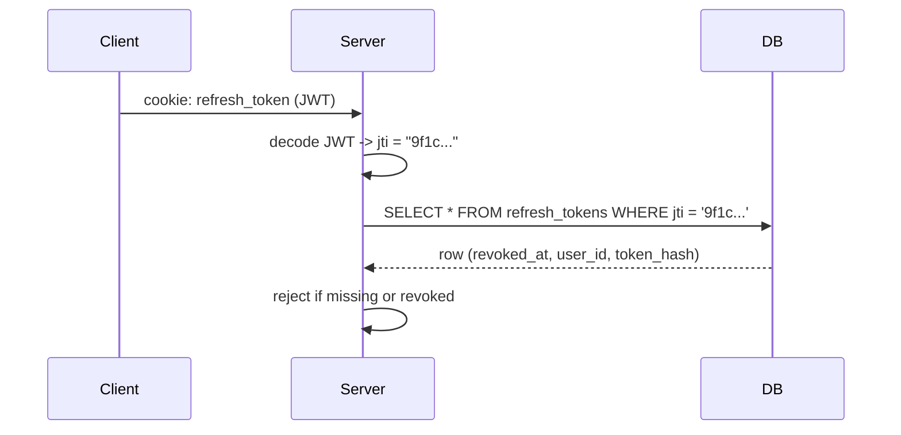

```mermaid
sequenceDiagram
    Client->>Server: cookie: refresh_token (JWT)
    Server->>Server: decode JWT -> jti = "9f1c..."
    Server->>DB: SELECT * FROM refresh_tokens WHERE jti = '9f1c...'
    DB-->>Server: row (revoked_at, user_id, token_hash)
    Server->>Server: reject if missing or revoked
```