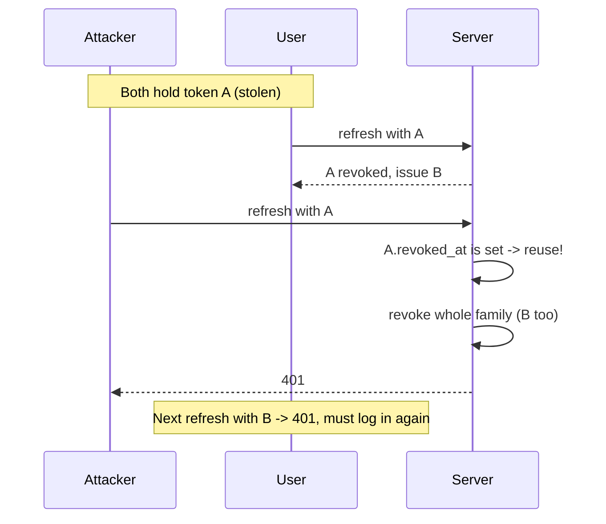

```mermaid
sequenceDiagram
    participant Attacker
    participant User
    participant Server
    Note over User,Attacker: Both hold token A (stolen)
    User->>Server: refresh with A
    Server-->>User: A revoked, issue B
    Attacker->>Server: refresh with A
    Server->>Server: A.revoked_at is set -> reuse!
    Server->>Server: revoke whole family (B too)
    Server-->>Attacker: 401
    Note over User: Next refresh with B -> 401, must log in again
```